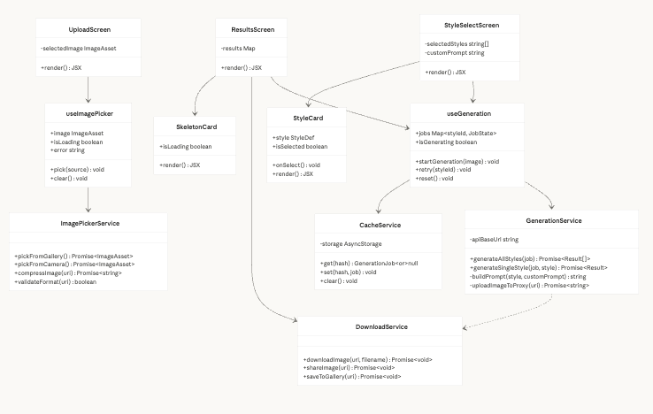
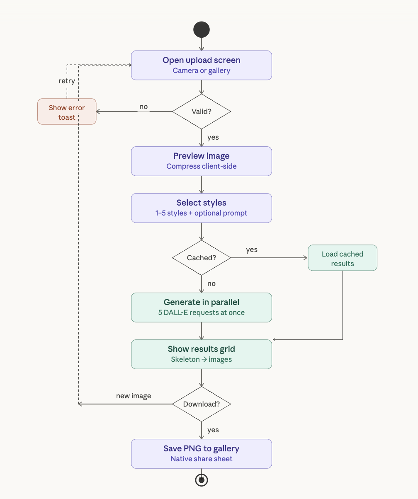
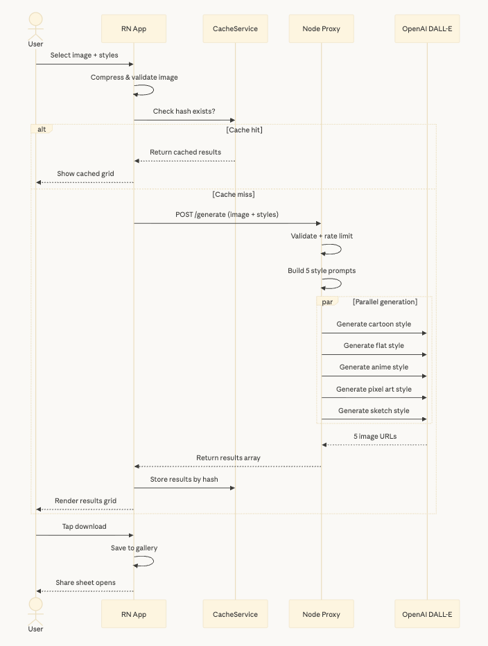
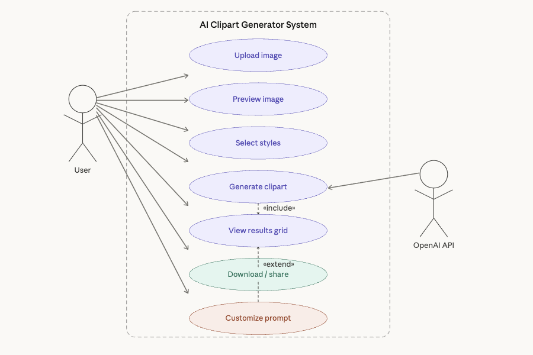

# AI Clipart Generator (Android App)

A production-quality React Native application that transforms user photos into premium clipart using AI. Built with a focus on high-end aesthetics, smooth performance, and secure architecture.

## 🚀 Vision & Design
The app features a **Premium Dark UI** inspired by modern design trends:
- **Warm Ambers & Glassmorphism**: High-contrast dark backgrounds with vibrant amber accents.
- **Dynamic Gradients**: Smooth transitions and glows throughout the user journey.
- **Custom Illustrations & Icons**: Professional iconography replacing generic emojis.
- **Smooth Micro-interactions**: Pulsing animations, spring-loaded buttons, and skeleton loaders.

## ✨ Key Features
- **Smart Image Upload**: Supports both Camera and Gallery with client-side compression.
- **Image-to-Image (img2img) Generation**: Clipart is generated specifically based on the subject in your photo, ensuring a personalized resemblance.
- **Multi-Style Selection**: Choose between 5 professional styles:
  - 🎬 **3D Cartoon**: Pixar-style 3D models.
  - 🎨 **Flat Illustration**: Modern minimalist vector art.
  - ⚡ **Anime**: High-quality cinematic anime.
  - 👾 **Pixel Art**: 32-bit retro game aesthetic.
  - ✏️ **Sketch**: Detailed graphite and ink drawings.
- **Async Batch Generation**: Process multiple styles at once with real-time progress states.
- **Native Share & Download**: High-resolution PNG output for sharing on social media.

## 🏗️ Technical Architecture
The system uses a 3-layer stack to ensure security and scalability:
1. **Frontend**: React Native (Expo SDK 54) + TypeScript.
2. **Backend Proxy**: Node.js (Express) handles API orchestration and hides sensitive keys.
3. **AI Core**: Community-powered **AI Horde** for 100% free image generation (no user costs).

### Architecture Diagrams
| Class Diagram | Activity Diagram | Sequence Diagram |
| :---: | :---: | :---: |
|  |  |  |  |

## 🛠️ Setup & Installation

### Prerequisites
- Node.js (v18+)
- Expo Go app on Android
- (Optional) EAS CLI for building APK

### 1. Backend Setup
```bash
cd backend
npm install
# No API Keys required (powered by AI Horde free tier)
node server.js
```

### 2. Frontend Setup
```bash
cd ..
npm install
npx expo start
```
*Scan the QR code with Expo Go to run on a physical device.*

### 3. Build APK
```bash
npx eas build -p android --profile preview
```

## 🧠 Tech Decisions & Tradeoffs
- **AI Horde vs. OpenAI**: Switched from Pollinations/OpenAI to AI Horde to provide a **100% free solution** for the assignment. 
  - *Tradeoff*: Generation takes ~30-60s vs ~10s, but it removes all payment barriers.
- **Base64 vs. Multi-part**: Used Base64 for image transmission to maintain a lightweight proxy body and simplify async job submission.
- **React Native Gesture Handler**: Used for smooth navigation and interaction states to avoid "janky" transitions.

## 🔗 Links
- **APK Download**: [Google Drive Link](LINK_HERE)
- **Screen Recording**: [Drive Walkthrough](LINK_HERE)
- **GitHub Repository**: [clipart-ai](GITHUB_LINK_HERE)

---
*Created for AI Clipart Generator Assignment - 2026*
